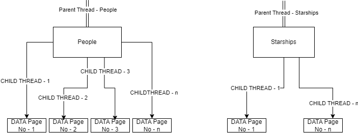
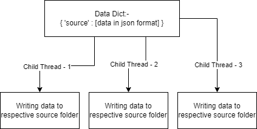

# ForceOfConcurrency

This repository demonstrates the use of Python's `threading` module to fetch data concurrently from the Star Wars API (SWAPI). The primary goal of the project is to compare different concurrency techniques, such as  and multithreading, to optimize data retrieval and storage.

## Project Overview

The project utilizes Python threads to perform concurrent network requests to multiple endpoints of the SWAPI. Each endpoint (e.g., people, planets, starships) is fetched concurrently across multiple pages, and the data is saved into a structured folder on the local system.

Key Concepts Covered:
- **Concurrency**: Uses Python’s `threading` module to achieve concurrent API requests.
- **I/O Bound Operations**: Optimizes the time spent on fetching data by parallelizing I/O operations.
- **SWAPI Integration**: Extracts data from multiple endpoints such as people, films, starships, and species.

## Project Structure

```
ForceOfConcurrency/
│
├── data/                    # Folder where fetched API data will be stored
│   ├── people/              # Contains JSON data for 'people' endpoint
│   ├── planets/             # Contains JSON data for 'planets' endpoint
│   ├── films/               # Contains JSON data for 'films' endpoint
│   └── ...                  # Other endpoints' data folders
├── multithreading           # Main script that drives the concurrency and data fetching logic 
    └── main.ipynb                
├── requirements.txt         # List of dependencies
└── README.md                # Project overview (this file)
```

## Key Functions

### `get_initial_data()`
Fetches the initial metadata from the SWAPI to determine available API endpoints.

### `create_folders()`
Creates a folder structure for each endpoint in the `data` directory where API results will be stored in separate JSON files.

### `get_data(endpoint)`
Calculates the number of pages available for each API endpoint and prepares URLs for concurrent fetching.

### `get_single_page_data(url, endpoint)`
Retrieves a single page of data from a specific endpoint and appends it to the corresponding dictionary.

### `file_op(source)`
Writes the retrieved data for each API endpoint to a separate JSON file stored under the corresponding folder.

## How It Works

1. **Data Fetching**: 
    - The API endpoints (e.g., people, starships, planets) are fetched in parallel using Python threads.
    - Each endpoint is assigned its own parent thread, which further creates child threads to fetch data from multiple pages concurrently.





2. **Data Storage**: 
    - The fetched data is stored in JSON format within corresponding subfolders (e.g., `data/people`, `data/planets`).



    
3. **Threading**:
    - Parent threads handle the API endpoint processing.
    - Child threads manage paginated data fetching for each endpoint.

## How to Run

1. Clone the repository:
    ```bash
    git clone https://github.com/SNEHILUPADHYAY007/ForceOfConcurrency.git
    cd ForceOfConcurrency
    ```

2. Install the required dependencies:
    ```bash
    pip install -r requirements.txt
    ```

3. Run the script:
    ```bash
    python main.py
    ```

   This will start fetching data from the SWAPI concurrently and store it in the `data/` folder.

## Concurrency Strategy

- **Parent-Child Threads**: Each SWAPI endpoint is handled by a parent thread, which creates child threads to manage paginated data requests.
- **Efficiency**: This approach ensures that multiple pages of data from the same endpoint are fetched concurrently, reducing overall runtime.
  
## Improvements Considered
- **Error Handling**: Retry logic can be added for API requests in case of intermittent failures.
- **Queue for Better Synchronization**: While the current approach works well, using a queue could help streamline thread management and error handling.
- **Generator Functions**: Consider using generators for data fetching, which will yield results one at a time rather than holding everything in memory at once. This will help if you have large datasets or paginated results.

